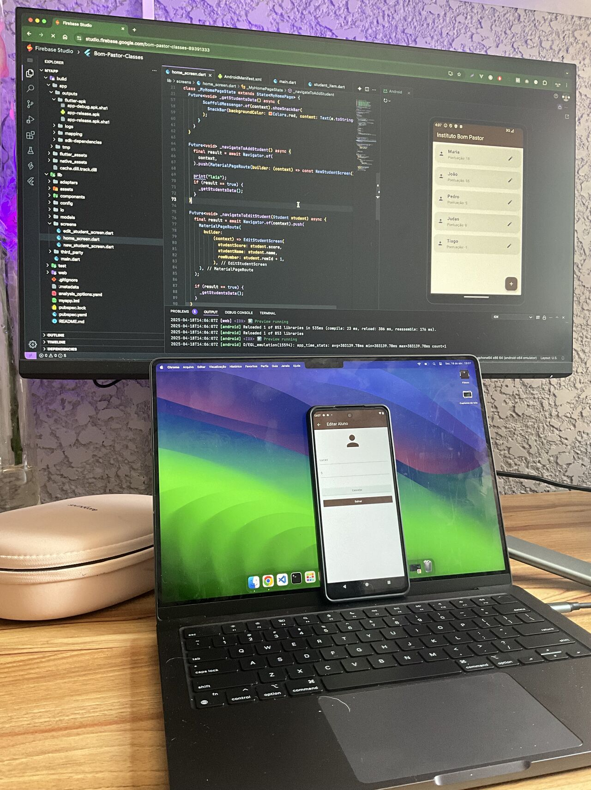
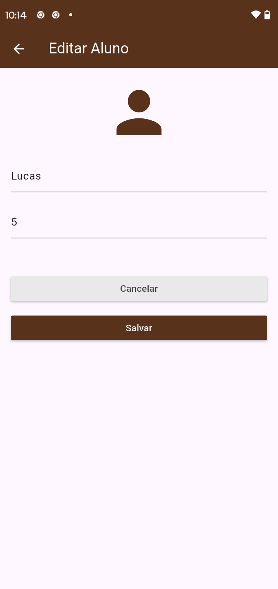
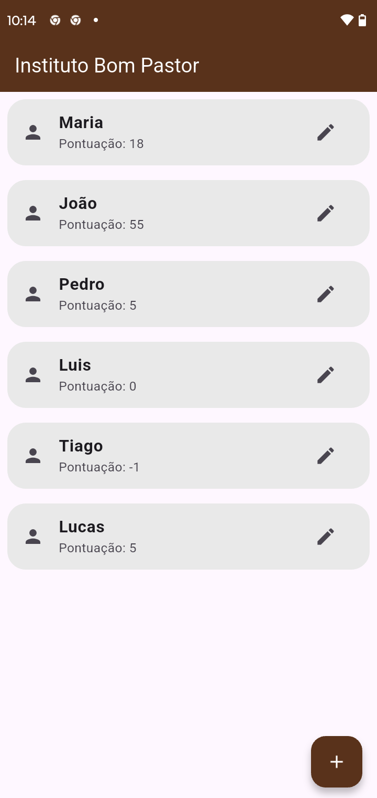

# Bom Pastor ONG

  

The Bom Pastor Institute is an organization located in the city of Piraquara (metropolitan region of Curitiba) and has several social initiatives, including the donation of food to the needy community and extracurricular activities for children and teenagers in the region.

The idea for the app came from a need at the institution: to create a gamified control system for the children and teenagers who are cared for by the Bom Pastor Institute. Students with the best behavior will earn points. These points are exchanged at the end of each month.

## App MVP

The 1º version has the following features:

- Student registration screen (initial score 0 - zero)
- Student list screen
- Editing of student data (name, current score, etc.)

### New Student screen

  

### New Student screen - validation

  

### Edit Student screen

  

### List Students screen

  

## Stack

- Flutter
- Firebase Studio for development
- Google Sheets as database

## 👩 Author

| [ <b>@laisfrigerio</b>](https://github.com/laisfrigerio)  |
| :--------------------------------------------------------------------------------------------------------------------------------------------------------------------------------: |

## 📄 License

This project is licensed under the MIT License - see the LICENSE.md file for details
